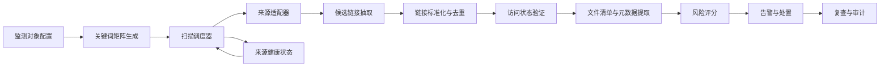

# 网盘敏感信息泄露监测企业级实施方案

## 1. 背景与目标

当前网盘监测模块已经具备基础能力：可以针对监测对象和关键词，从若干网盘聚合搜索源检索候选链接，识别部分网盘分享链接，记录命中、错误和扫描统计。代码中也已经存在部分增量扫描、来源健康、命中复核、平台会话和告警相关能力，后续实施必须先复用这些能力，再补齐缺口。

但现状仍偏向演示型采集，主要问题是：

- 当前运行配置下仍可能表现为每轮从第 1 页重新开始，按 `page_limit` 固定扫同一个窗口；实施时要先确认 `NETDISK_SCAN_MODE`、定时任务环境变量和现有增量状态是否真正接入生产扫描。
- 默认来源数量有限，主要依赖少量网盘聚合搜索站和 PanSou。
- 关键词体系较弱，难以覆盖企业真实泄露场景中的简称、项目名、文件名、系统名和敏感字段组合。
- 对登录拦截、验证码、限流、重复页、空页等情况只有错误记录，缺少源健康状态和自动降级策略。
- 命中验证、风险分级、告警、处置、复查、审计链路不完整。

本方案目标是把当前模块升级为企业级、可持续运行的网盘敏感信息泄露监测能力。

企业级目标定义如下：

- 覆盖主流公开网盘分享入口、聚合搜索站、通用搜索引擎、论坛/社媒线索和历史传播页面。
- 支持持续增量扫描，而不是每小时重复扫描同一批页面。
- 对发现链接进行标准化、去重、访问状态验证和证据留存。
- 对命中内容进行风险评分、分级告警和处置闭环管理。
- 对数据源健康、关键词覆盖率、扫描深度、误报率、漏报回归进行可观测管理。
- 在合规边界内运行：不绕过权限控制，不破解验证码，不批量下载敏感文件，优先采集元数据和取证截图。

## 2. 成功标准

### 2.1 发现能力

- 每个监测对象至少支持 50 个以上有效关键词或关键词组合。
- 支持 `公司名 / 简称 / 英文名 / 域名 / 邮箱后缀 / 项目名 / 系统名 / 敏感文件名模式` 的组合查询。
- 默认覆盖不少于 10 类公开发现来源：
  - 网盘聚合搜索站。
  - PanSou / PanHub 等本地或自建聚合 API。
  - Bing / 百度 / 360 搜索。
  - 网盘分享直链搜索。
  - 论坛、博客、问答、贴吧类公开页面。
  - Telegram 公开频道或公开索引页。
  - 搜索引擎缓存或转载页。
  - 历史扫描结果复查。
  - 人工导入线索。
  - 第三方情报源导入。

### 2.2 持续扫描能力

- 每个来源、关键词、页码有独立游标。
- 首页高频复扫，深页按窗口轮转。
- 连续空页、重复页、验证码、登录拦截、限流时自动降频。
- 新增结果在下一轮扫描中能被识别为新增，而不是重复命中。

### 2.3 验证与取证能力

- 对百度网盘、阿里云盘、夸克网盘、123 云盘、迅雷网盘、OneDrive、115、UC 网盘等链接进行标准化识别。
- 支持访问状态识别：公开、失效、需验证码、需登录、拒绝访问、限流、未知。
- 对发现页和分享页保存 HTML、截图、源 URL、发现时间、扫描任务 ID、关键词、来源。
- 默认仅采集文件清单、目录结构、文件名、扩展名、大小等元数据。

### 2.4 风险分级与处置能力

- 每条命中有风险分值和风险等级。
- 高危命中可在 5 分钟内推送告警。
- 命中支持状态流转：新发现、待复核、已确认、误报、处置中、已下架、复查通过。
- 每条处置动作保留审计记录。

### 2.5 可观测性

- 展示每个来源的成功率、错误率、验证码率、限流率、最近成功时间。
- 展示每个关键词的扫描页数、候选数、命中数、有效命中率。
- 展示最近 7 天和 30 天新增趋势、平台分布、风险分布、处置进度。

### 2.6 企业级非功能标准

- 支持角色权限控制：管理员、分析员、处置员、只读审计员。
- 支持敏感证据访问审计，任何截图、HTML、文件清单查看都记录操作者和时间。
- 支持认证源的凭据加密存储、过期提醒、人工更新和一键禁用。
- 支持任务幂等和断点恢复，扫描进程重启后不会丢失游标或重复生成命中。
- 支持数据库迁移、索引优化、备份恢复和数据保留策略。
- 支持 SLA 指标：高危告警延迟、扫描成功率、来源可用率、误报率、处置时长。

## 3. 总体架构



建议保持现有 `document_exposure.py` 的对外 API 兼容。下面这些边界是能力拆分建议，不代表必须全部新建文件；如果当前项目已有等价能力，必须优先复用，只在缺口位置做小范围补齐：

- 分页游标、扫描窗口、来源健康：优先复用 `darkweb_collector/src/darkweb_collector/db.py` 中已有的 `netdisk_source_states`、`netdisk_source_health` 及 `document_exposure.py` 中的增量页码逻辑。
- 关键词矩阵和组合查询：新增配置化模板管理，但模板内容由管理员导入或维护，不写死进代码。
- 分享链接标准化、平台识别、去重指纹：优先复用 `document_hits.canonical_url`、现有访问状态探测和命中详情结构，缺少观察记录时再补表。
- 风险评分：优先复用 `document_exposure.py` 中已有的 `_score_document_hit`，再扩展为可配置企业策略。
- 告警分发：优先复用 `monitoring_notifications.py` 和 `bot_assistant.py`，不要另建一套 webhook 配置。
- 认证源账号、Cookie、Token 和会话有效性：优先复用 `document_exposure_sessions.py`、`platform_session_login.py` 和 `/api/platform-sessions`。
- 扫描任务、队列分发、重试和幂等控制：优先复用 `celery_app.py`、`tasks.py`、`queueing.py` 和现有后台任务状态。
- 证据文件落盘、脱敏、权限校验和保留清理：优先复用现有 `document_exposure` 输出目录、命中快照和详情页能力，再补访问审计。
- 覆盖率、成功率、告警延迟、处置 SLA 等指标：优先复用现有扫描历史、来源状态和 summary API。

### 3.1 现有能力复用与重复建设检查

执行任何阶段前，都必须先做一次“已有能力、缺口、禁止重复建设”对照检查。

| 计划能力 | 当前项目已存在的能力点 | 实施要求 |
| --- | --- | --- |
| 网盘分页状态 | `netdisk_source_states`、`list_netdisk_source_states_payload`、`reset_netdisk_source_states_payload`、`NETDISK_SCAN_MODE`、`_netdisk_incremental_page_numbers` | 先确认生产环境为什么仍表现为固定页扫描；优先修复配置、定时任务环境变量或接入路径，不重复建状态表 |
| 来源健康 | `netdisk_source_health`、`ensure_netdisk_source_health_defaults`、`list_netdisk_source_health_payload`、`netdisk_source_policy` | 先复用现有健康表和策略字段，再补启停、退避和前端可视化缺口 |
| 代码监测增量经验 | `code_search_states`、`_persist_search_state`、代码监测的分页状态测试 | 只借鉴成熟模式，不把代码监测表混用到网盘模块 |
| 命中、去重和复核 | `document_hits`、`canonical_url`、`risk_score`、`access_state`、`document_hit_reviews` | 不新建一套网盘命中主表；只在现有命中模型无法表达传播观察时补观察表 |
| 访问状态和文件清单 | `_probe_netdisk_link_access_state`、网盘文件清单抓取函数、命中详情页 | 先扩展现有探测器和详情 payload，不另写并行详情系统 |
| 平台登录会话 | `platform_sessions`、`document_exposure_sessions.py`、`platform_session_login.py`、`fetch_page_artifacts_with_session` | 论坛、博客、代码平台、网盘搜索站需要登录时统一接入现有平台会话机制 |
| 前端 API 和页面 | `useDocumentExposureApi.js`、`DocumentExposureWorkbench.vue`、`DocumentExposureSettings.vue`、`DocumentExposureDetail.vue` | 继续挂在文件监测/网盘监测页面体系下，不另做独立应用 |
| 队列和后台任务 | `celery_app.py`、`tasks.py`、`queueing.py`、`api_actions.py` 后台任务状态 | 企业化调度先复用现有队列和 worker 分层，再补网盘专用任务类型 |
| 告警通知 | `monitoring_notifications.py`、`bot_assistant.py`、企业微信/机器人配置 | 高危网盘告警复用现有通知出口，增加告警去重和 SLA 字段 |
| 统一事件和大盘 | `normalized_intelligence.py`、`build_document_exposure_event_records`、summary 统计 | 网盘命中继续进入现有文件监测/统一事件流，避免形成孤立数据孤岛 |

## 4. 分阶段实施计划

## 阶段一：有状态增量扫描

目标：解决当前“每小时重复扫描同几页”的核心问题。

### 4.1 复用并核验扫描状态表

当前项目中已经存在 `netdisk_source_states` 表和读写函数。实施第一阶段时不要重复建表，先核验目标环境是否已经具备以下字段、索引、API 和扫描接入逻辑；只有缺字段或缺索引时才做兼容迁移。

```sql
CREATE TABLE IF NOT EXISTS netdisk_source_states (
    id INTEGER PRIMARY KEY AUTOINCREMENT,
    watchlist_id INTEGER NOT NULL,
    source_key TEXT NOT NULL,
    term TEXT NOT NULL,
    source_family TEXT NOT NULL DEFAULT 'netdisk_aggregator',
    next_page INTEGER NOT NULL DEFAULT 1,
    last_scanned_page INTEGER NOT NULL DEFAULT 0,
    page_window_size INTEGER NOT NULL DEFAULT 4,
    consecutive_empty_pages INTEGER NOT NULL DEFAULT 0,
    consecutive_repeated_pages INTEGER NOT NULL DEFAULT 0,
    last_candidate_signature TEXT NOT NULL DEFAULT '',
    last_success_at TEXT NOT NULL DEFAULT '',
    last_error_at TEXT NOT NULL DEFAULT '',
    last_error TEXT NOT NULL DEFAULT '',
    backoff_until TEXT NOT NULL DEFAULT '',
    created_at TEXT NOT NULL,
    updated_at TEXT NOT NULL,
    UNIQUE(watchlist_id, source_key, term, source_family)
);
```

用途：

- 保存每个来源和关键词下一次应该扫描的页码。
- 记录连续空页和重复页。
- 支持错误后的退避。
- 支持管理员重置某个来源或关键词的游标。

核验重点：

- `NETDISK_SCAN_MODE=incremental` 是否在实际 API/定时任务进程中生效。
- `scan_watchlist_once` 是否读取了已有状态并写回 `next_page`、`last_scanned_page`。
- 前端是否调用 `/api/document-exposures/netdisk/source-states` 展示游标状态。
- 现有测试是否覆盖 legacy 和 incremental 两种模式。

### 4.2 修改扫描窗口逻辑

当前 legacy 运行逻辑：

- 每轮从第 1 页开始。
- 最多扫描到 `page_limit`。
- 无候选、重复页、错误时停止当前来源。

目标 incremental 运行逻辑：

- 首页窗口：每轮固定复扫第 1 页或第 1-2 页。
- 深页窗口：按 `next_page` 继续扫描，例如本轮 1-4，下一轮 5-8，再下一轮 9-12。
- 如果深页连续空页超过阈值，则回到首页并降低深页频率。
- 如果发现重复页，记录签名并推进或降频。
- 如果来源报验证码、登录、限流，进入 `backoff_until`，短期跳过。

示例策略：

```text
每轮扫描 = 首页窗口 + 深页窗口

首页窗口：
  page 1，每小时扫描

深页窗口：
  page_window_size = 4
  next_page = 2
  本轮扫 2-5
  成功后 next_page = 6
  下一轮扫 6-9

停止条件：
  连续 3 页空结果 -> next_page 回到 2，深页扫描降频
  连续 2 页重复结果 -> next_page 前进一个窗口
  登录/验证码/限流 -> 设置 backoff_until
```

### 4.3 复用并补齐来源健康表

当前项目中已经存在 `netdisk_source_health` 表、默认来源补齐逻辑和只读 API。实施时先复用现有结构；如缺少启停、退避、SLA 或前端展示，再做增量补齐。

```sql
CREATE TABLE IF NOT EXISTS netdisk_source_health (
    source_key TEXT PRIMARY KEY,
    enabled INTEGER NOT NULL DEFAULT 1,
    status TEXT NOT NULL DEFAULT 'healthy',
    success_count INTEGER NOT NULL DEFAULT 0,
    error_count INTEGER NOT NULL DEFAULT 0,
    login_required_count INTEGER NOT NULL DEFAULT 0,
    captcha_count INTEGER NOT NULL DEFAULT 0,
    rate_limited_count INTEGER NOT NULL DEFAULT 0,
    consecutive_failures INTEGER NOT NULL DEFAULT 0,
    last_success_at TEXT NOT NULL DEFAULT '',
    last_error_at TEXT NOT NULL DEFAULT '',
    last_error TEXT NOT NULL DEFAULT '',
    backoff_until TEXT NOT NULL DEFAULT '',
    updated_at TEXT NOT NULL
);
```

状态枚举：

- `healthy`：正常。
- `degraded`：错误率较高，但仍可低频扫描。
- `blocked`：登录、验证码、限流导致暂停。
- `disabled`：人工禁用。

### 4.4 后端接口

已有或需要补齐的接口：

- `GET /api/document-exposures/netdisk/source-states`
- `POST /api/document-exposures/netdisk/source-states/reset`
- `GET /api/document-exposures/netdisk/source-health`
- `POST /api/document-exposures/netdisk/source-health/{source_key}/enable`
- `POST /api/document-exposures/netdisk/source-health/{source_key}/disable`

### 4.5 前端页面

在网盘扫描页面新增“扫描覆盖”区域：

- 来源。
- 关键词。
- 当前游标。
- 最近扫描页。
- 连续空页。
- 连续重复页。
- 最近成功时间。
- 最近错误。
- 健康状态。
- 重置游标按钮。

### 4.6 验收标准

- 连续运行 3 轮后，同一个来源和关键词的深页扫描窗口不再固定为 1-4 页。
- 关闭程序再启动后，游标仍然延续。
- 登录、验证码、限流来源进入退避状态，不再每轮重复打同一个错误。
- 首页仍保持高频复扫，避免漏掉新发布结果。

### 4.7 索引与迁移要求

如果目标环境已经有 `netdisk_source_states` 和 `netdisk_source_health`，不要再次创建平行表；只核验索引和字段是否完整。缺失字段、缺失索引或旧库不兼容时，使用兼容迁移补齐，否则企业场景下扫描记录增长后会很快变慢。

建议索引：

```sql
CREATE INDEX IF NOT EXISTS idx_netdisk_source_states_due
ON netdisk_source_states(source_key, term, next_page, backoff_until);

CREATE INDEX IF NOT EXISTS idx_netdisk_source_states_watchlist
ON netdisk_source_states(watchlist_id, source_key, updated_at);

CREATE INDEX IF NOT EXISTS idx_netdisk_source_health_status
ON netdisk_source_health(status, backoff_until, updated_at);
```

迁移要求：

- 所有新增或补齐的表结构通过数据库初始化或迁移函数创建，不手工改库。
- 已有监测对象首次运行时自动补齐默认状态。
- 迁移过程不清空已有命中、扫描记录和处置记录。
- 增加迁移测试：空库、旧库、有历史扫描记录三种情况都能启动。

## 阶段二：关键词矩阵与查询模板

目标：扩大企业敏感信息发现面。

### 5.1 关键词类型

为每个监测对象维护以下字段：

- 企业中文全称。
- 企业英文名。
- 简称。
- 股票简称。
- 品牌名。
- 域名。
- 邮箱后缀。
- 子公司名称。
- 项目代号。
- 业务系统名称。
- 内部部门名称。
- 供应商名称。
- 高敏字段。
- 文件名模式。

### 5.2 查询模板

新增表 `netdisk_query_templates`。

```sql
CREATE TABLE IF NOT EXISTS netdisk_query_templates (
    id INTEGER PRIMARY KEY AUTOINCREMENT,
    name TEXT NOT NULL,
    template TEXT NOT NULL,
    source_family TEXT NOT NULL DEFAULT 'netdisk_aggregator',
    enabled INTEGER NOT NULL DEFAULT 1,
    priority INTEGER NOT NULL DEFAULT 100,
    created_at TEXT NOT NULL,
    updated_at TEXT NOT NULL
);
```

查询模板不写死进代码。代码只负责读取、校验、展开和执行模板；模板内容由管理员在前端维护，或通过 CSV/Excel/JSON 导入。

可导入的模板示例：

```text
{company}
{company} {file_type}
{company} 通讯录
{company} 员工
{company} 客户名单
{company} 合同
{company} 财务
{company} 报价单
{company} 供应商
{company} 图纸
{company} BOM
{domain}
{domain} xlsx
{email_suffix}
{project_name}
{system_name}
```

模板管理要求：

- 支持人工新增、编辑、禁用、删除。
- 支持批量导入和导出。
- 支持按行业、企业、监测对象绑定不同模板集。
- 支持模板优先级、每日预算、来源适用范围。
- 支持模板命中率、误报率和最近使用时间统计。
- 系统可以提供示例模板文件，但不能把模板内容作为不可修改的代码常量。

### 5.3 查询预算

企业级不能无限制生成查询，需要查询预算：

- 全局每日最大查询数和全局每小时最大请求数。
- 每个监测对象每日最大查询数。
- 每个来源每小时最大请求数。
- 每个来源并发数、最小请求间隔和退避时间。
- 每个企业、每个来源、每个模板的公平分配权重。
- 高危关键词优先。
- 低收益查询自动降频。

预算不是按企业线性累加。企业数量增加后，系统必须先受全局预算和来源预算约束，再在企业之间做公平调度。例如：

```text
全局每小时预算：300 次
Bing dork 每小时预算：80 次
皮卡搜索每小时预算：30 次
懒盘搜索每小时预算：30 次
爱搜每小时预算：30 次
PanSou API 每小时预算：60 次
人工导入/历史复查：不消耗外部请求预算

企业 A 高优先级：权重 3
企业 B 普通优先级：权重 1
企业 C 普通优先级：权重 1

调度时先满足高风险、新增、复查任务，再按权重分配剩余额度。
```

多企业场景的预算规则：

- 来源预算是硬上限，所有企业共享；不能因为企业从 10 家增加到 100 家，就把同一来源请求放大 10 倍。
- 企业预算是分配额度，不是绕过来源预算的额外额度。
- 模板预算受企业预算和来源预算双重约束。
- 低命中、低置信、高误报查询进入降频队列。
- 高危命中复查、已公开链接复核、人工导入线索优先级高于普通扩展查询。
- 来源出现登录拦截、验证码、限流、429、403、连接失败时，立即扣减可用预算并进入退避。
- 退避期间不通过代理池或绕过验证码继续请求；需要更高覆盖量时，应优先接入官方 API、商业数据源或企业授权账号。

建议调度模型：

```text
待执行查询 -> 去重 -> 评分排序 -> 全局预算检查 -> 来源预算检查 -> 企业公平分配 -> 执行 -> 记录命中率和错误率 -> 动态调整预算
```

这样做的目的不是把所有模板都尽快跑完，而是在不打崩来源、不影响其他模块的前提下，持续覆盖最高价值查询。

### 5.4 资产画像输入

关键词矩阵不能完全靠人工录入，应支持从企业资产画像生成。

资产画像字段：

- 组织全称、简称、英文名、历史名称、品牌名。
- 一级域名、邮箱后缀、重要子域名。
- 子公司、事业部、工厂、研发中心、海外主体。
- 关键业务系统、移动 App、供应链平台、客户门户。
- 项目代号、产品型号、产线名称、内部文档编号前缀。
- 高敏词库：人事、财务、法务、客户、供应链、研发、源代码、图纸、BOM。
- 白名单：公开官网、公开招聘、公开招投标、公开宣传材料。

资产画像来源：

- 手工录入。
- CSV/Excel 导入。
- 现有资产管理系统导入。
- 历史命中反向沉淀。

### 5.5 关键词质量治理

- 每个关键词记录候选数、有效命中数、误报数和最近命中时间。
- 高误报关键词自动降权，但不自动删除。
- 长期无命中的低优先级关键词降低扫描频率。
- 新增高危命中反向生成推荐关键词，等待人工确认。

### 5.6 验收标准

- 一个企业监测对象可自动生成不少于 50 个查询词。
- 支持手动禁用低质量查询。
- 每个查询词保留命中率和最近扫描状态。
- 查询扩展后，扫描任务仍能在预算内完成。

## 阶段三：来源扩展与适配器管理

目标：从少量固定源扩展到多类型发现来源。

### 6.1 来源分类

来源分为：

- `netdisk_search`：网盘聚合搜索站。
- `netdisk_api`：PanSou、PanHub、自建聚合 API。
- `search_engine`：Bing、百度、360。
- `social_forum`：论坛、贴吧、博客、问答。
- `telegram_public`：公开 Telegram 频道或索引页。
- `manual_import`：人工导入。
- `threat_feed`：第三方情报源。

### 6.2 搜索引擎 dork

搜索引擎模板示例：

```text
"{company}" "pan.baidu.com/s"
"{company}" "aliyundrive.com/s"
"{company}" "pan.quark.cn/s"
"{company}" "123pan.com/s"
"{domain}" "网盘"
"{company}" filetype:xls
"{company}" filetype:xlsx
"{company}" "通讯录" "网盘"
```

### 6.3 适配器契约

每个来源适配器返回统一结构：

```json
{
  "source": "pikasoo",
  "term": "宁德时代 合同",
  "page": 3,
  "source_url": "https://example/search?q=...",
  "candidates": [
    {
      "title": "xxx",
      "url": "https://pan.baidu.com/s/xxx",
      "preview_text": "xxx",
      "published_at": "",
      "raw": {}
    }
  ],
  "error": "",
  "block_reason": ""
}
```

### 6.4 来源健康策略

- `login_required`：暂停 6 小时。
- `captcha`：暂停 12 小时，提示人工检查。
- `rate_limited`：指数退避，1 小时、2 小时、4 小时。
- `timeout`：连续 3 次后降级。
- `parse_error`：记录样本 HTML，用于适配器修复。

### 6.5 公开源与认证源分层

扩展论坛、博客、贴吧、问答、Telegram 时必须区分公开源和认证源。

公开源：

- 不需要登录即可访问的公开帖子、公开频道 Web 页面、搜索结果页和转载页。
- 默认优先接入。
- 只采集公开可见内容，不绕过访问限制。

认证源：

- 需要企业授权账号、Cookie、Token 或 API Key 的来源。
- 必须使用企业专用监测账号，不使用个人账号。
- 凭据加密存储，前端只显示来源名称、有效期、最近验证时间，不回显明文。
- 支持手动更新、禁用、删除凭据。
- 登录失效、MFA、验证码、权限不足时停止该来源扫描并进入人工处理。

认证源状态字段：

```text
unauthenticated
valid
expired
mfa_required
captcha_required
permission_denied
disabled
```

Telegram 分层：

- `t.me/s/{channel}` 公开页面：可作为公开源。
- Telegram API 客户端：需要企业专用手机号或账号授权，作为认证源。
- Bot API：只处理机器人有权限访问的频道或群，不作为广泛搜索入口。
- 私有群或受限频道：没有授权不采集。

### 6.6 来源优先级与接入顺序

第一批优先接入：

- 当前已有网盘聚合源。
- PanSou / PanHub。
- Bing dork。
- 人工导入。
- Telegram 公开频道 Web 页面。

第二批接入：

- 百度/360 dork。
- 贴吧、论坛、问答公开搜索页。
- 第三方情报源。

第三批接入：

- 企业授权认证源。
- 私有 API 或商业数据源。

### 6.7 验收标准

- 新增来源可以独立启停。
- 单个来源故障不影响整个扫描任务。
- 每个来源都有成功率、错误率和最近样本。
- 至少接入 3 类来源：网盘聚合、搜索引擎、人工导入。
- 认证源凭据过期不会导致全局任务失败。
- 公开源和认证源在界面、日志和审计中有明确标识。

## 阶段四：链接标准化、去重与访问验证

目标：把“候选链接”变成“可确认的泄露线索”。

### 7.1 链接标准化

新增模块 `netdisk_link_normalize.py`。

标准化规则：

- 提取真实分享链接，去除跳转包装。
- 去除无意义追踪参数。
- 统一平台标识。
- 生成 `canonical_url`。
- 生成 `link_fingerprint`。

支持平台：

- 百度网盘：`pan.baidu.com/s/`
- 阿里云盘：`aliyundrive.com/s/`
- 夸克网盘：`pan.quark.cn/s/`
- 123 云盘：`123pan.com/s/`、`123684.com/s/`
- 迅雷网盘：`pan.xunlei.com/s/`
- OneDrive：`onedrive.live.com`
- 115：`115.com/s/`
- UC 网盘：`drive.uc.cn`

### 7.2 观察记录表

新增表 `document_link_observations`。

```sql
CREATE TABLE IF NOT EXISTS document_link_observations (
    id INTEGER PRIMARY KEY AUTOINCREMENT,
    hit_id INTEGER,
    link_fingerprint TEXT NOT NULL,
    canonical_url TEXT NOT NULL,
    source_key TEXT NOT NULL,
    source_url TEXT NOT NULL,
    term TEXT NOT NULL,
    page INTEGER NOT NULL DEFAULT 1,
    title TEXT NOT NULL DEFAULT '',
    preview_text TEXT NOT NULL DEFAULT '',
    access_state TEXT NOT NULL DEFAULT '',
    http_status INTEGER NOT NULL DEFAULT 0,
    content_hash TEXT NOT NULL DEFAULT '',
    parser_version TEXT NOT NULL DEFAULT '',
    observed_at TEXT NOT NULL,
    evidence_html_path TEXT NOT NULL DEFAULT '',
    evidence_screenshot_path TEXT NOT NULL DEFAULT ''
);
```

用途：

- 同一个分享链接可能被多个来源发现，主命中只保留一条。
- 每次发现作为观察记录追加，形成传播证据链。

### 7.3 访问状态验证

验证结果字段：

- `public`：公开可访问。
- `removed`：链接失效。
- `captcha`：需要验证码。
- `login_required`：需要登录。
- `forbidden`：拒绝访问。
- `rate_limited`：限流。
- `unknown`：无法确认。

### 7.4 短链、跳转与文本抽取

企业泄露线索常出现在跳转链接、短链或文本片段里，标准化模块需要支持：

- 从正文、标题、评论、附件描述中抽取网盘链接。
- 识别 `http` 跳转、搜索结果跳转、论坛外链跳转。
- 对短链只做安全展开，设置请求次数和域名白名单，避免无限跳转。
- 对提取失败的页面保留原始样本，供适配器规则回归。

### 7.5 观察记录索引

```sql
CREATE INDEX IF NOT EXISTS idx_document_link_observations_fingerprint
ON document_link_observations(link_fingerprint, observed_at);

CREATE INDEX IF NOT EXISTS idx_document_link_observations_source
ON document_link_observations(source_key, term, observed_at);

CREATE INDEX IF NOT EXISTS idx_document_link_observations_hit
ON document_link_observations(hit_id, observed_at);
```

### 7.6 验收标准

- 同一分享链接重复发现不会重复生成主命中。
- 能展示同一链接被哪些来源、哪些关键词、哪些页面发现过。
- 访问状态变化可以被记录，例如从 `public` 变为 `removed`。
- 跳转链接、短链和正文中的网盘链接能被抽取并关联到原始来源页。

## 阶段五：文件清单、敏感内容识别与风险评分

目标：企业用户看到的不只是链接，而是风险级别和处置优先级。

### 8.1 文件清单采集

默认只采集元数据：

- 文件名。
- 扩展名。
- 文件大小。
- 目录层级。
- 分享标题。
- 分享者可见信息。
- 分享时间，如果页面可见。

默认不批量下载文件内容。确需下载时，应增加人工确认和合规审计。

### 8.2 证据存储与脱敏

证据包括发现页 HTML、发现页截图、分享页 HTML、分享页截图、文件清单 JSON、访问状态记录。

存储要求：

- 按 `watchlist_id / source_key / date / hit_id` 分目录保存。
- 文件名使用安全哈希，不直接暴露敏感标题。
- 证据文件记录 `sha256`，用于完整性校验。
- 前端查看证据时走后端鉴权接口，不直接暴露本地绝对路径。
- 对手机号、身份证号、邮箱等字段提供前端脱敏展示。
- 原始证据下载需要管理员权限，并记录审计日志。

新增表 `document_evidence_assets`：

```sql
CREATE TABLE IF NOT EXISTS document_evidence_assets (
    id INTEGER PRIMARY KEY AUTOINCREMENT,
    hit_id INTEGER NOT NULL,
    observation_id INTEGER,
    asset_type TEXT NOT NULL,
    storage_path TEXT NOT NULL,
    sha256 TEXT NOT NULL DEFAULT '',
    size_bytes INTEGER NOT NULL DEFAULT 0,
    redacted INTEGER NOT NULL DEFAULT 0,
    created_at TEXT NOT NULL
);

CREATE INDEX IF NOT EXISTS idx_document_evidence_assets_hit
ON document_evidence_assets(hit_id, asset_type, created_at);
```

### 8.3 默认敏感规则基线

以下规则只能作为默认基线，不能作为所有企业通用的固定泄露标准。真正上线时，每个企业、每类监测对象都必须能配置自己的泄露判定策略。

默认高危规则：

- 包含 `通讯录`、`员工信息`、`身份证`、`手机号`、`客户名单`。
- 包含 `合同`、`报价`、`财务`、`发票`。
- 包含 `源码`、`代码`、`数据库`、`sql`、`备份`。
- 包含 `图纸`、`BOM`、`工艺`、`配方`。
- 压缩包内文件数量异常大。

默认中危规则：

- 内部制度、培训材料、会议纪要。
- 项目材料、供应商资料。
- 非公开 PPT、Word、Excel。

默认低危规则：

- 已公开宣传材料。
- 公开招投标材料。
- 无明显内部属性的普通文档。

### 8.4 企业泄露判定策略

不同企业对“泄露”的定义不一样，必须把泄露标准做成可配置策略，而不是写死在代码里。

策略分层：

```text
系统默认基线规则
  -> 行业模板规则
    -> 企业专属规则
      -> 监测对象覆盖规则
        -> 白名单 / 例外项
```

行业模板示例：

- 制造业：图纸、BOM、工艺、报价单、供应商、质量报告、产线资料。
- 金融业：客户清单、交易流水、风控模型、征信材料、账户信息。
- 互联网：源码、配置文件、数据库备份、API Key、用户数据、运营报表。
- 医疗：患者信息、检测报告、病历、医保数据、临床研究资料。
- 政企：内部通知、会议纪要、招采材料、人员信息、涉密项目名称。

企业专属规则示例：

- 某企业认为“公开招投标文件”不是泄露，可加入白名单。
- 某企业认为“供应商报价单”属于高危，可提高规则权重。
- 某企业认为“项目代号 + zip”命中即高危，可增加组合规则。
- 某企业只关注特定子公司或特定业务线，可设置监测对象级策略。

建议新增表 `netdisk_leakage_policies`：

```sql
CREATE TABLE IF NOT EXISTS netdisk_leakage_policies (
    id INTEGER PRIMARY KEY AUTOINCREMENT,
    name TEXT NOT NULL,
    industry TEXT NOT NULL DEFAULT '',
    description TEXT NOT NULL DEFAULT '',
    enabled INTEGER NOT NULL DEFAULT 1,
    created_at TEXT NOT NULL,
    updated_at TEXT NOT NULL
);
```

建议新增表 `netdisk_leakage_policy_rules`：

```sql
CREATE TABLE IF NOT EXISTS netdisk_leakage_policy_rules (
    id INTEGER PRIMARY KEY AUTOINCREMENT,
    policy_id INTEGER NOT NULL,
    rule_type TEXT NOT NULL,
    pattern TEXT NOT NULL,
    match_field TEXT NOT NULL DEFAULT 'any',
    risk_delta INTEGER NOT NULL DEFAULT 0,
    risk_level TEXT NOT NULL DEFAULT '',
    action TEXT NOT NULL DEFAULT 'score',
    enabled INTEGER NOT NULL DEFAULT 1,
    created_at TEXT NOT NULL,
    updated_at TEXT NOT NULL
);
```

字段说明：

- `rule_type`：`keyword`、`regex`、`file_ext`、`platform`、`access_state`、`combined`、`whitelist`。
- `match_field`：`title`、`file_name`、`preview_text`、`url`、`source`、`any`。
- `action`：`score`、`force_high`、`force_low`、`ignore`、`whitelist`、`alert_only`。
- `risk_delta`：命中规则后增加或降低的分值。
- `risk_level`：强制风险等级，可为空。

监测对象应关联策略：

```text
watchlist_id -> leakage_policy_id
```

如果未配置企业专属策略，则使用系统默认基线策略；如果配置了企业策略，则企业策略优先。

### 8.5 风险评分模型

风险评分模型也不能写死。以下分值是默认基线，最终分值应由“默认规则 + 行业模板 + 企业策略 + 白名单例外”共同决定。

```text
基础分：
  公开可访问 +30
  需验证码 +15
  失效链接 +5

文件类型：
  xls/xlsx/csv/sql +25
  zip/rar/7z +20
  doc/docx/pdf/ppt/pptx +15

敏感词：
  员工/客户/通讯录/身份证/手机号 +35
  合同/财务/报价/发票 +25
  源码/数据库/备份 +30
  图纸/BOM/工艺 +30

规模：
  文件数 > 100 +20
  文件数 > 1000 +35

来源：
  多来源重复发现 +10
```

等级：

- `high`：分值 >= 75。
- `medium`：分值 45-74。
- `low`：分值 < 45。

### 8.6 误报反馈与规则版本

- 每次风险评分记录 `rule_version`。
- 误报原因分类：公开资料、同名企业、无关关键词、历史无效链接、平台误识别。
- 误报反馈不直接删除命中，而是降低同类规则权重或加入白名单候选。
- 风险规则调整后支持对最近 30 天命中重算评分。

### 8.7 验收标准

- 每条命中有明确风险等级和评分原因。
- 高危命中可以按评分原因排序。
- 误报复核后可以反馈到规则，降低同类误报。
- 证据文件可校验完整性，且查看、下载都有审计记录。
- 同一条命中在不同企业策略下可以得到不同风险等级。
- 企业白名单和例外规则可以覆盖默认基线规则。

## 阶段六：告警、处置与复查闭环

目标：从“发现问题”升级为“推动问题关闭”。

### 9.1 告警规则

默认告警条件：

- 新增高危公开链接。
- 新增包含员工、客户、财务、源码、图纸类敏感文件名的链接。
- 同一链接在多个来源传播。
- 已处置链接再次变为可访问。

告警渠道：

- 企业微信。
- 钉钉。
- 邮件。
- Webhook。
- 工单系统。

### 9.2 处置状态

状态流转：

```text
new -> triage -> confirmed -> takedown_pending -> removed -> recheck_passed
new -> false_positive
confirmed -> accepted_risk
removed -> reappeared
```

### 9.3 审计字段

每次处置记录：

- 操作人。
- 操作时间。
- 状态变化。
- 备注。
- 证据附件。
- 复查结果。

### 9.4 验收标准

- 高危新增命中能自动推送。
- 每条命中能看到完整处置历史。
- 已下架链接可按周期复查。
- 重现链接能自动重新打开处置流程。

### 9.5 告警去重、升级与 SLA

告警不能简单每次命中都推送，应增加告警治理：

- 同一 `link_fingerprint + risk_level` 在去重窗口内只推送一次。
- 同一链接风险等级升高时重新推送。
- 同一链接从 `removed` 变回 `public` 时重新推送。
- 高危告警 30 分钟未确认，升级给二线或管理员。
- 处置超时按 SLA 标红。

建议 SLA：

```text
高危公开链接：5 分钟内告警，30 分钟内确认，24 小时内完成处置动作。
中危链接：30 分钟内告警，1 个工作日内确认，3 个工作日内处置。
低危链接：进入日报，不强制实时告警。
来源异常：连续失败 3 次后 1 小时内提示维护。
```

## 阶段七：前端企业级工作台

目标：让运营人员能高效使用，而不是只看原始表格。

### 10.1 总览页面

指标：

- 今日新增命中。
- 高危新增命中。
- 公开可访问链接数。
- 已下架链接数。
- 待复核数量。
- 来源健康异常数量。

### 10.2 扫描覆盖页面

展示：

- 来源健康状态。
- 关键词覆盖情况。
- 当前扫描窗口。
- 近 24 小时扫描页数。
- 近 24 小时候选数。
- 近 24 小时有效命中数。
- 错误来源 Top 10。

### 10.3 命中处置页面

能力：

- 按风险、平台、访问状态、关键词、来源筛选。
- 查看证据截图和文件清单。
- 一键标记误报。
- 一键进入处置。
- 一键复查访问状态。

### 10.4 配置页面

能力：

- 管理监测对象。
- 管理关键词矩阵。
- 管理查询模板。
- 管理来源启停和优先级。
- 管理告警规则。
- 管理扫描预算。

## 阶段八：调度队列、权限安全与运维保障

目标：补齐企业部署和长期运行能力，避免扫描规模扩大后任务互相阻塞、证据失控或数据不可恢复。

### 11.1 任务队列模型

建议把扫描拆成 5 类任务：

- `query_discovery`：按来源、关键词、页码发现候选链接。
- `link_normalize`：标准化链接、提取真实分享地址、计算指纹。
- `access_probe`：验证访问状态。
- `file_listing`：采集文件清单元数据。
- `alert_dispatch`：告警分发和处置复查。

任务要求：

- 每个任务有 `task_id`、`watchlist_id`、`source_key`、`term`、`page`、`idempotency_key`。
- 同一 `idempotency_key` 在活跃窗口内只执行一次。
- 失败任务进入重试队列，超过阈值写入死信队列。
- 不同来源有独立并发和速率限制。

### 11.2 Worker 与并发控制

建议最小部署：

```text
api_server: 1
query_worker: 2
probe_worker: 2
file_listing_worker: 1
alert_worker: 1
scheduler: 1
```

扩容规则：

- 发现任务可以横向扩展，但每个来源必须受单源限速约束。
- 访问验证任务优先处理高危候选。
- 文件清单任务受合规策略限制，不做无限并发。
- 告警任务必须保证幂等，避免重复推送。

### 11.3 权限与审计

角色：

- `admin`：系统配置、来源启停、凭据管理、证据下载。
- `analyst`：查看命中、复核风险、发起处置。
- `operator`：处理工单、更新处置状态。
- `auditor`：只读查看审计和报表。

审计事件：

- 登录、登出。
- 查看证据。
- 下载证据。
- 修改监测对象。
- 修改关键词。
- 修改来源配置。
- 修改认证凭据。
- 修改风险规则。
- 修改处置状态。

### 11.4 备份与恢复

- SQLite 场景下每天备份数据库文件，并保留最近 30 天。
- 证据目录按日期增量备份。
- 备份文件做完整性校验。
- 每月至少做一次恢复演练。
- 生产环境建议迁移到 PostgreSQL，并把证据文件放到受控对象存储或受控文件服务器。

### 11.5 部署配置

关键配置项：

```text
DARKWEB_COLLECTOR_DB_PATH
DARKWEB_COLLECTOR_OUTPUT_ROOT
REDIS_URL
NETDISK_QUERY_WORKER_CONCURRENCY
NETDISK_PROBE_WORKER_CONCURRENCY
NETDISK_SOURCE_RATE_LIMIT_DEFAULT
NETDISK_EVIDENCE_RETENTION_DAYS
NETDISK_ALERT_WEBHOOK_URL
NETDISK_AUTH_SECRET_KEY
```

### 11.6 运维看板

必须展示：

- 队列积压量。
- 最近任务失败数。
- 死信任务数。
- 平均扫描耗时。
- 单源请求量和错误率。
- 告警发送成功率。
- 证据目录占用空间。
- 数据库大小和最近备份时间。

### 11.7 验收标准

- 任意一个来源卡住不会阻塞其他来源。
- API 重启后队列任务和扫描游标可恢复。
- 高危告警不会重复推送。
- 证据查看、下载、配置修改都有审计记录。
- 可从最近备份恢复数据库和证据文件。

## 12. 测试方案

### 12.1 单元测试

覆盖：

- 分页游标推进。
- 连续空页处理。
- 重复页签名处理。
- 来源退避逻辑。
- 查询模板展开。
- 链接标准化。
- 风险评分。
- 认证源状态机。
- 告警去重和 SLA 升级。
- 证据文件哈希校验。

### 12.2 集成测试

使用模拟 HTML 和模拟 API：

- pikasoo 多页结果。
- lzpanx 第 4 页登录拦截。
- esoua 第 1 页登录拦截。
- pandashi 空结果。
- PanSou API 空结果和有效结果。
- 搜索引擎 dork 抽取网盘链接。
- 公开 Telegram 页面抽取链接。
- 认证源凭据过期后自动禁用该来源。
- 队列任务失败后进入重试和死信队列。

### 12.3 回归测试

建立固定样本：

- 公开可访问链接样本。
- 失效链接样本。
- 验证码样本。
- 登录拦截样本。
- 重复页样本。
- 空页样本。
- 短链和跳转样本。
- 同名企业误报样本。
- 已处置链接重新公开样本。

### 12.4 验收测试

连续运行 24 小时，检查：

- 深页窗口是否持续推进。
- 首页是否持续复扫。
- 来源异常是否自动退避。
- 新增链接是否去重。
- 高危命中是否告警。
- 处置状态是否可审计。
- API 和 Worker 重启后扫描状态是否恢复。
- 备份文件是否能恢复到测试环境。
- 权限不足用户是否无法查看或下载证据。

## 13. 运维与合规要求

### 13.1 运行安全

- 设置每个来源的请求频率上限。
- 设置全局并发上限。
- 设置重试次数和退避时间。
- 避免对单一来源造成高频压力。

### 13.2 合规边界

- 不绕过登录权限。
- 不破解验证码。
- 不下载非必要敏感文件。
- 不扩大传播敏感链接。
- 对证据访问设置权限控制。
- 对敏感证据存储加访问审计。

### 13.3 数据保留

建议：

- 原始 HTML 保留 90 天。
- 截图证据保留 180 天。
- 命中元数据和处置记录长期保留。
- 误报样本长期保留，用于规则优化。

### 13.4 KPI 与周期性复盘

每周复盘指标：

- 来源可用率。
- 每个来源有效命中率。
- 每个关键词有效命中率。
- 新增高危命中数。
- 高危告警平均延迟。
- 高危处置平均时长。
- 误报率。
- 复现链接数量。
- 扫描任务失败率。

每月复盘动作：

- 淘汰低质量来源。
- 调整高误报关键词。
- 补充新网盘平台和新搜索源。
- 回放模拟泄露样本，检查漏报。
- 检查证据留存、备份和权限审计。

## 14. 里程碑计划

### M1：增量扫描基础版

周期：3-5 个工作日。

交付：

- `netdisk_source_states`。
- `netdisk_source_health`。
- 深页窗口轮转。
- 首页高频复扫。
- 来源退避。
- 基础前端展示。

验收：

- 连续扫描 3 轮后，深页页码不再固定。
- 来源错误不会每轮重复打满。

### M2：关键词矩阵与查询模板

周期：3-5 个工作日。

交付：

- 关键词扩展模块。
- 查询模板配置。
- 查询预算。
- 关键词命中统计。

验收：

- 单个企业对象可生成 50 个以上查询。
- 可控制高低优先级和扫描预算。

### M3：来源扩展与搜索引擎 dork

周期：5-8 个工作日。

交付：

- 搜索引擎适配器。
- 网盘直链抽取。
- 人工导入入口。
- 来源健康工作台。

验收：

- 至少 3 类来源稳定运行。
- 单个来源故障不影响整体扫描。

### M4：链接验证、文件清单与风险评分

周期：5-8 个工作日。

交付：

- 链接标准化。
- 观察记录表。
- 访问状态验证。
- 文件清单元数据。
- 风险评分。

验收：

- 重复链接合并为单一主命中。
- 高危命中有明确评分原因。

### M5：告警与处置闭环

周期：5-8 个工作日。

交付：

- 告警规则。
- Webhook/邮件/企业微信或钉钉集成。
- 处置状态流转。
- 复查任务。
- 审计记录。

验收：

- 新增高危命中可自动告警。
- 已下架链接可周期复查。

## 15. 优先级建议

优先做 P0：

- 有状态分页游标。
- 来源健康和退避。
- 首页复扫加深页轮转。
- 链接标准化和去重。

然后做 P1：

- 关键词矩阵。
- 搜索引擎 dork。
- 风险评分。
- 文件清单元数据。

最后做 P2：

- 告警。
- 工单。
- 报表。
- 审计。
- 第三方情报源导入。

原因：

- 如果不先解决分页游标，扫描再多来源也会重复浪费。
- 如果不先做链接标准化和去重，后续告警会产生大量重复噪声。
- 如果不先做来源健康，系统会被验证码、登录拦截和限流拖垮。

## 16. 第一阶段详细开发任务

### 16.1 后端任务

1. 核验数据库初始化中已有的 `netdisk_source_states` 和 `netdisk_source_health`；缺字段、缺索引时用兼容迁移补齐，不重复建表。
2. 核验并复用现有状态读写函数：
   - `list_netdisk_source_states`
   - `get_netdisk_source_state`
   - `upsert_netdisk_source_state`
   - `reset_netdisk_source_states`
   - `list_netdisk_source_health`
   - `upsert_netdisk_source_health`
3. 核验并补齐候选页扫描逻辑：
   - legacy 模式保持当前页码窗口。
   - incremental 模式读取 `next_page` 和 `page_window_size`。
   - 返回或记录 `next_page`、空页数、重复页数、错误原因。
4. 核验 `scan_watchlist_once`：
   - 网盘模式读取状态。
   - 首页固定扫描。
   - 深页按游标扫描。
   - 扫描结束后保存状态。
5. 核验并补齐健康状态判断：
   - 如果 `backoff_until` 未过期，跳过来源。
   - 如果连续失败超过阈值，设置 `degraded` 或 `blocked`。
6. 复用或补齐 API：
   - 状态列表。
   - 健康列表。
   - 重置游标。
   - 启停来源。

### 16.2 前端任务

1. 在网盘扫描页增加“来源健康”区块。
2. 在扫描详情展开行中增加：
   - 当前游标。
   - 下次扫描页。
   - 退避截止时间。
   - 健康状态。
3. 在配置页增加来源启停和优先级展示。
4. 增加“重置游标”按钮。

### 16.3 测试任务

1. 单元测试：首次扫描从第 1 页开始。
2. 单元测试：第二轮扫描深页从上次结束后继续。
3. 单元测试：连续空页后回到首页并降低深页频率。
4. 单元测试：登录拦截后设置退避。
5. 集成测试：模拟 pikasoo、lzpanx、esoua、pandashi、pansou。
6. API 测试：状态查询、重置游标、来源禁用。

## 17. 关键风险与应对

### 17.1 来源不稳定

风险：网盘搜索站结构变化、登录拦截、验证码、限流。

应对：

- 每个来源独立健康状态。
- 保留失败样本。
- 适配器独立测试。
- 失败自动退避。

### 17.2 误报过多

风险：公开材料、新闻稿、招投标文件被误判。

应对：

- 风险评分透明化。
- 误报反馈规则。
- 白名单关键词和白名单 URL。
- 同一链接多来源传播加权，不仅靠单个标题命中。

### 17.3 漏报

风险：关键词不足、来源不足、深页扫描不足。

应对：

- 关键词矩阵。
- 搜索引擎 dork。
- 深页轮转。
- 人工导入线索回归。
- 模拟泄露样本验证。

### 17.4 合规风险

风险：下载或传播敏感文件、绕过权限。

应对：

- 默认只采集元数据。
- 不绕过验证码和登录权限。
- 证据访问控制。
- 操作审计。

### 17.5 凭据和账号风险

风险：认证源账号失效、凭据泄露、个人账号混用、MFA 阻断扫描。

应对：

- 只使用企业专用监测账号。
- 凭据加密存储。
- 凭据过期前提醒。
- MFA 或验证码触发后停止该来源并等待人工处理。
- 所有凭据修改进入审计日志。

### 17.6 数据规模风险

风险：历史扫描记录、证据截图、HTML 样本快速增长，导致数据库和磁盘膨胀。

应对：

- 索引和分页查询。
- 证据保留期限。
- 历史冷数据归档。
- 定期清理低价值失败样本。
- 运维看板展示数据库大小和证据目录大小。

## 18. 最小可行版本范围

如果先做一个能明显提升能力的版本，建议只做以下范围：

- `netdisk_source_states`。
- `netdisk_source_health`。
- 首页复扫。
- 深页游标轮转。
- 错误退避。
- 前端展示当前游标和健康状态。
- 链接标准化基础版。

这个版本完成后，系统就能从“固定页重复采集”升级为“持续增量监测”，后续再扩源、扩关键词和加告警才有实际价值。

## 19. 覆盖面复核结论

复核后判断：原方案的主线正确，但更偏功能建设方案；如果直接按原版执行，能解决当前固定页重复扫描问题，但还不足以支撑企业级长期运行。现已补齐认证源、资产画像、索引迁移、队列调度、证据安全、权限审计、SLA、KPI、备份恢复等内容，完整度已达到可拆任务、可排期、可验收的实施方案级别。

### 19.1 原方案已经覆盖的关键能力

- 有状态增量扫描。
- 来源健康和退避。
- 关键词矩阵。
- 多来源扩展。
- 搜索引擎 dork。
- 链接标准化和去重。
- 访问状态验证。
- 文件清单元数据采集。
- 风险评分。
- 告警和处置闭环。
- 前端工作台。
- 基础测试、运维和合规要求。

### 19.2 本次复核补齐的关键遗漏

- 公开源与认证源分层，明确哪些来源不需要登录，哪些来源必须使用企业授权账号。
- 认证源凭据管理，包括 Cookie、Token、API Key、登录失效、MFA、验证码和权限不足处理。
- 企业资产画像输入，避免关键词完全依赖人工录入。
- 关键词质量治理，支持高误报关键词降权和高价值关键词沉淀。
- 数据库索引、迁移和旧库兼容，避免数据量增长后性能退化。
- 观察记录增强，加入访问状态、HTTP 状态、内容哈希和解析器版本。
- 短链、跳转链接、正文链接抽取。
- 证据存储、脱敏、哈希校验和访问审计。
- 告警去重、升级和 SLA。
- 任务队列、Worker 拆分、幂等键、重试和死信队列。
- 权限角色、审计事件、备份恢复和部署配置。
- KPI 与周/月复盘机制。

### 19.3 仍需在实施前确认的事项

- 实际允许接入哪些外部来源，尤其是认证源和第三方情报源。
- 企业是否能提供专用监测账号、手机号、API Key 或商业数据源授权。
- 证据文件允许保存多久，是否需要加密存储或放入指定文件服务器。
- 告警要接入企业微信、钉钉、邮件还是工单系统。
- 生产环境继续用 SQLite，还是迁移到 PostgreSQL。
- 是否允许下载单个样本文件用于人工复核；如果允许，需要审批和审计流程。

### 19.4 详细程度评价

当前文档已经足够指导第一阶段和第二阶段开发，尤其是分页游标、来源健康、关键词矩阵、认证源分层和链接去重都可以直接拆成任务。

进入第三阶段以后，还需要为每个具体来源单独补“来源适配器设计卡片”，包括：

- 来源 URL 和查询模板。
- 是否需要登录。
- 分页规则。
- 反爬和限流表现。
- 结果页 HTML 样本。
- 候选链接解析规则。
- 阻断识别规则。
- 单元测试样本。

因此结论是：总体方案现在够完整，已经覆盖企业级建设所需的主链路和非功能要求；实施到具体来源时，还需要逐个补充适配器级细节。

### 19.5 与现有项目功能点重复检查结论

本次复核确认，网盘监测升级不能按“从零新增模块”执行。当前项目已经具备一批可复用能力，实施时必须以“核验现有能力是否生效、补齐缺口”为主。

| 能力点 | 是否已有 | 处理结论 |
| --- | --- | --- |
| 网盘来源状态表 | 已有 `netdisk_source_states` | 不重复建表；先核验生产库字段、索引、状态写回和定时任务环境变量 |
| 网盘来源健康表 | 已有 `netdisk_source_health` | 不重复建表；补前端启停、退避可视化和健康策略即可 |
| 增量分页逻辑 | 已有 `NETDISK_SCAN_MODE`、legacy/incremental 测试 | 先查当前运行环境是否仍是 legacy；不要另写一套分页器 |
| 命中主表和复核 | 已有 `document_hits`、`document_hit_reviews` | 不新增网盘命中主表；只补传播观察或策略字段 |
| 访问状态验证 | 已有 `_probe_netdisk_link_access_state` 和详情页文件清单能力 | 扩展现有探测器，不新增平行验证服务 |
| 平台登录会话 | 已有 `platform_sessions` 和 `/api/platform-sessions` | 扩源需要登录时接入现有会话管理，不新建账号系统 |
| 队列与 worker | 已有 Celery、queueing 和后台任务入口 | 企业化调度复用现有 worker 结构，增加网盘任务类型和幂等键 |
| 告警通知 | 已有企业微信/机器人通知链路 | 网盘高危告警复用现有通知出口，增加告警规则和去重 |
| 前端文件监测页面 | 已有文件监测工作台、配置页、详情页、API composable | 网盘能力继续在现有页面体系扩展，不另建独立前端应用 |

实施门禁：每个阶段开工前，必须在任务单中写明“复用哪些现有文件/表/API、哪些能力确实缺失、哪些旧能力不能改”。如果不能证明是缺口，不允许新增平行表、平行 API 或平行前端页面。
