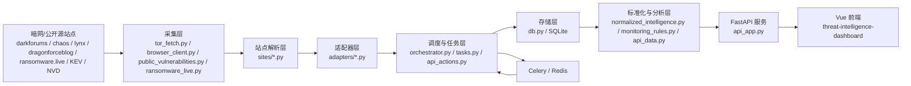
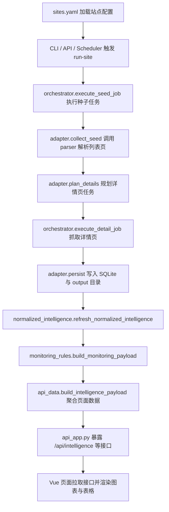
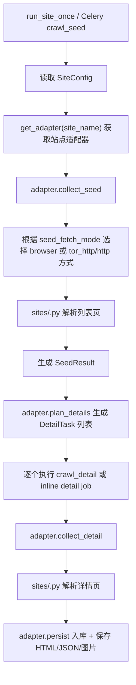
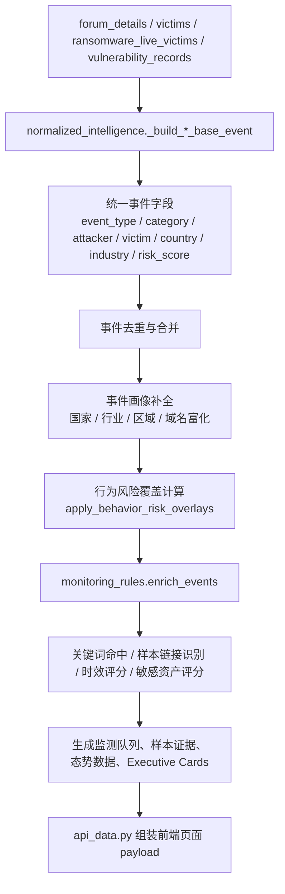
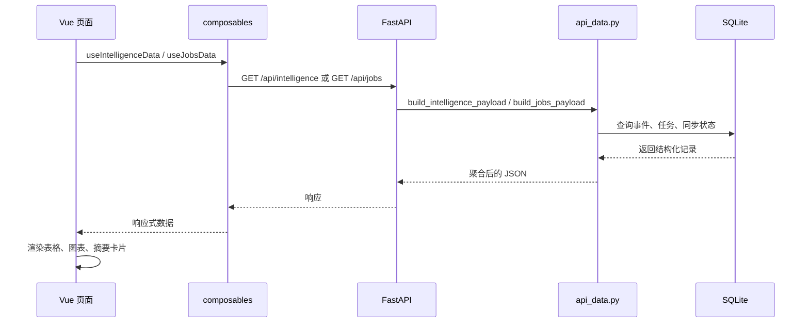

# 项目技术文档

## 1. 文档目的

本文档用于系统化说明 `D:\bishe` 项目的整体实现方式，回答以下问题：

- 项目整体架构是什么
- 后端采集系统、标准化分析系统、API 服务、前端展示系统分别如何实现
- 各目录、各关键文件分别承担什么职责
- 数据从“站点抓取”到“情报展示”的完整流程是什么
- 项目如何启动、调度、入库、分析、展示

本文档面向导师、答辩评审、后续维护者，也可作为项目二次开发时的技术参考。

---

## 2. 项目概览

本项目由两个核心子系统组成：

- `darkweb_collector`：后端采集、标准化、情报提取、API 服务与任务调度系统
- `threat-intelligence-dashboard`：前端威胁情报展示与控制台

此外，根目录还包含 Tor/代理环境脚本、WSL 启动脚本和若干运维辅助脚本，用于保证 `.onion` 站点访问、运行时数据库同步和整套系统启动。

从能力上看，本项目实现了以下完整链路：

1. 配置站点与抓取模式
2. 按站点执行列表页采集
3. 从列表页规划详情页任务
4. 抓取详情页并生成结构化结果
5. 将原始采集结果写入 SQLite
6. 将多来源数据统一标准化为情报事件
7. 对事件执行关键词监测、样本证据识别、风险评分
8. 聚合为仪表盘、威胁态势、漏洞预警、勒索情报等 API 数据
9. 前端通过 REST API 展示并支持运行控制

---

## 3. 总体目录结构

```text
D:\bishe
├─ darkweb_collector                 # 后端采集与情报处理系统
├─ threat-intelligence-dashboard     # 前端仪表盘
├─ tor-downloads                     # Tor 相关资源目录
├─ tor-migration-package             # Tor 迁移包目录
├─ run_onion_crawler.sh              # Onion 抓取辅助脚本
├─ run_onion_playwright_wsl.sh       # WSL 下 Playwright Onion 抓取辅助脚本
├─ torbrowser-socks-check.sh         # Tor SOCKS 可用性检查
├─ torbrowser-socks-env.sh           # Tor SOCKS 环境变量设置
├─ TOR_BRIDGE_STRATEGY.md            # Tor 网桥策略说明
├─ proxy.conf                        # 代理配置样例
├─ verify_parser.py                  # 解析结果验证辅助脚本
└─ README.md                         # 根目录简要说明
```

---

## 4. 技术栈

### 4.1 后端

后端依赖定义在 `darkweb_collector/requirements.txt`：

- `FastAPI`：提供 REST API
- `Uvicorn`：运行 API 服务
- `Playwright`：浏览器抓取、绕过纯 HTTP 抓取失败场景
- `Celery`：异步任务队列
- `Redis`：Celery broker、状态存储
- `pycountry`：国家/地区识别与映射
- `Babel`：国际化能力支持
- SQLite：采集结果、任务记录、标准化情报存储

### 4.2 前端

前端依赖定义在 `threat-intelligence-dashboard/package.json`：

- `Vue 3`：前端框架
- `Vue Router`：路由管理
- `Pinia`：状态管理基础设施
- `Element Plus`：UI 组件库
- `ECharts` + `vue-echarts`：图表展示
- `Vite`：构建与本地开发
- `Sass`：样式预处理

---

## 5. 系统总体架构



系统可以理解为“采集-解析-入库-标准化-监测-展示”的分层流水线。

---

## 6. 核心业务流程

### 6.1 端到端业务主流程



### 6.2 列表页与详情页采集流程



### 6.3 标准化与监测分析流程



### 6.4 前后端交互流程



---

## 7. 后端系统实现详解：`darkweb_collector`

---

## 7.1 后端目录结构

```text
darkweb_collector
├─ README.md
├─ QUEUE_WORKFLOW.md
├─ requirements.txt
├─ sites.yaml
├─ data/                         # SQLite 数据库与缓存
├─ output/                       # 各站点抓取输出
├─ samples/                      # 样本 HTML / JSON / 回归测试数据
├─ scripts/                      # 启动、修复、导入、评估脚本
├─ templates/                    # 站点脚手架模板
├─ tests/                        # 单元测试与集成测试
└─ src/darkweb_collector/        # 核心业务代码
```

---

## 7.2 配置层

### 目录

- `darkweb_collector/sites.yaml`
- `darkweb_collector/src/darkweb_collector/config.py`
- `darkweb_collector/src/darkweb_collector/models.py`
- `darkweb_collector/src/darkweb_collector/runtime.py`

### 实现说明

#### 1. `sites.yaml`

负责定义站点级运行配置，包括：

- `site_name`
- `enabled`
- `seed_urls`
- `seed_fetch_mode`
- `detail_fetch_mode`
- `profile`
- `max_topics_per_run`
- `max_detail_pages_per_run`
- `cooldown_seconds`
- `output_dir`
- `dedupe_window_minutes`
- `render_wait_seconds`

当前已配置站点包括：

- `dragonforce`
- `darkforums`
- `chaos`
- `lynx`
- `dragonforceblog`

#### 2. `config.py`

负责：

- 加载 `sites.yaml`
- 校验配置合法性
- 将配置转换为 `SiteConfig`
- 提供按站点读取配置能力
- 允许动态启停站点

关键函数：

- `load_site_configs()`
- `get_site_config(site_name)`
- `set_site_enabled(site_name, enabled)`

#### 3. `models.py`

定义后端核心数据结构：

- `SiteConfig`：站点配置对象
- `RunContext`：单次任务上下文
- `SeedResult`：列表页采集结果
- `DetailTask`：详情页任务描述
- `DetailResult`：详情页解析结果

#### 4. `runtime.py`

负责统一项目基础路径：

- `project_root()`
- `default_config_path()`
- `default_db_path()`

---

## 7.3 抓取层：Tor / HTTP / Browser

### 目录

- `src/darkweb_collector/tor_fetch.py`
- `src/darkweb_collector/browser_client.py`
- `src/darkweb_collector/detail_extract.py`
- `src/darkweb_collector/normalize.py`
- `src/darkweb_collector/utils.py`

### 实现说明

#### 1. `tor_fetch.py`

这是底层抓取入口，负责决定目标 URL 应该如何抓取。

核心职责：

- 判断 URL 是否为 `.onion`
- 读取 Tor SOCKS 配置
- 读取普通 HTTP 代理配置
- 支持基于 curl 的 Tor 访问
- 支持普通代理访问
- 支持浏览器场景下的代理地址生成

关键函数：

- `is_onion_url()`
- `get_tor_socks_settings()`
- `get_http_proxy_settings()`
- `browser_proxy_server_for_url()`
- `fetch_url()`
- `fetch_page_artifacts()`
- `fetch_via_tor_curl()`
- `fetch_via_http_proxy()`

#### 2. `browser_client.py`

负责 Playwright 浏览器抓取与页面工件生成。

核心职责：

- 维护浏览器客户端
- 基于代理创建浏览器上下文
- 抓取渲染后的 HTML
- 生成页面截图
- 处理浏览器检查页与过渡页

关键函数：

- `fetch_html_with_browser()`
- `fetch_page_artifacts_with_browser()`
- `screenshot_html_with_browser()`
- `close_browser_client()`

#### 3. `detail_extract.py`

提供通用详情抽取能力，适合作为非定制场景下的兜底解析器。

关键函数：

- `parse_generic_detail()`

#### 4. `normalize.py`

提供采集结果级别的基础标准化：

- 状态标准化
- 文件大小转换为 GB
- 内容哈希生成

关键函数：

- `normalize_status()`
- `size_to_gb()`
- `content_hash()`

#### 5. `utils.py`

提供通用工具能力：

- UTC 时间格式输出
- JSON / 文本落盘
- 文件名安全化

关键函数：

- `utc_now_iso()`
- `dump_json()`
- `dump_text()`
- `safe_stem()`

---

## 7.4 站点解析层：`sites/`

### 目录职责

`src/darkweb_collector/sites/` 负责“把某个站点的 HTML 解析成结构化结果”，属于站点级 parser 层。

### 文件说明

#### `sites/darkforums.py`

职责：

- 解析 `DarkForums` 列表页
- 解析详情页
- 识别受害者、攻击者、行业、区域
- 规范化帖子时间

关键函数：

- `parse_darkforums_list()`
- `parse_darkforums_detail()`
- `extract_victims_from_content()`
- `extract_attackers_from_content()`
- `determine_industry()`
- `determine_region()`
- `normalize_darkforums_timestamp()`

#### `sites/chaos.py`

职责：

- 解析 `chaos` 首页与详情页

关键函数：

- `parse_chaos_homepage()`
- `parse_chaos_detail()`

#### `sites/dragonforce.py`

职责：

- 解析 `dragonforce` 首页泄露列表

关键函数：

- `parse_dragonforce_homepage()`

#### `sites/dragonforceblog.py`

职责：

- 解析 `dragonforceblog` 列表页与详情页
- 解码站点 payload 序列

关键函数：

- `parse_dragonforceblog_list_page()`
- `parse_dragonforceblog_detail_page()`
- `_decode_payload_sequence()`

#### `sites/lynx.py`

职责：

- 解析 `Lynx` 列表页与详情页

关键函数：

- `parse_lynx_list_page()`
- `parse_lynx_detail_page()`

#### `sites/example_forum.py`

职责：

- 作为样例/模板站点 parser

关键函数：

- `parse_example_forum_homepage()`

#### `sites/registry.py`

职责：

- 注册 parser
- 提供站点名到 parser 的映射

关键函数：

- `list_parsers()`
- `get_parser(site_name)`

---

## 7.5 适配器层：`adapters/`

### 目录职责

`src/darkweb_collector/adapters/` 负责把“具体 parser 的结果”接入统一采集框架，是 parser 与调度/入库之间的桥梁。

适配器做三件事：

1. `collect_seed`：抓取并解析列表页
2. `plan_details`：从列表结果中规划详情任务
3. `persist`：把结果写入数据库和输出目录

### 文件说明

#### `adapters/base.py`

- 定义 `SiteAdapter` 协议接口

#### `adapters/darkforums.py`

- `DarkforumsAdapter`
- 处理板块名识别
- 处理详情页工件判定与持久化

#### `adapters/chaos.py`

- `ChaosAdapter`

#### `adapters/dragonforce.py`

- `DragonforceAdapter`

#### `adapters/dragonforceblog.py`

- `DragonforceblogAdapter`

#### `adapters/lynx.py`

- `LynxAdapter`

#### `adapters/registry.py`

- `list_adapters()`
- `get_adapter(site_name)`

### 适配器层定位

如果说 `sites/*.py` 只负责“怎么解析 HTML”，那么 `adapters/*.py` 则负责“怎么把解析结果并入统一采集体系”。

---

## 7.6 调度与任务执行层

### 目录

- `src/darkweb_collector/orchestrator.py`
- `src/darkweb_collector/tasks.py`
- `src/darkweb_collector/queueing.py`
- `src/darkweb_collector/state_store.py`
- `src/darkweb_collector/celery_app.py`
- `src/darkweb_collector/cli.py`

### 实现说明

#### 1. `orchestrator.py`

这是后端采集执行主控文件。

核心职责：

- 创建任务 ID
- 标记任务开始与结束
- 执行种子任务
- 执行详情任务
- 执行单站点一次运行
- 将应运行站点投递进队列

关键函数：

- `execute_seed_job()`
- `execute_detail_job()`
- `run_site_once()`
- `enqueue_due_sites()`
- `mark_job_running()`
- `mark_job_finished()`

#### 2. `tasks.py`

这是 Celery worker 的任务入口。

核心职责：

- 将 `seed` 与 `detail` 任务变成异步任务
- 在 worker 中调用 `orchestrator`

关键函数：

- `crawl_seed()`
- `crawl_detail()`

#### 3. `queueing.py`

负责队列名和 worker 命令映射。

关键函数：

- `queue_for_seed(fetch_mode)`
- `queue_for_detail(fetch_mode)`
- `retry_backoff_seconds()`
- `build_worker_command(queue_name)`

当前队列设计：

- `seed_http`
- `detail_http`
- `browser_render`

#### 4. `state_store.py`

负责运行时去重和并发槽位控制。

实现：

- `InMemoryStateStore`
- `RedisStateStore`

接口函数：

- `get_state_store(prefer_redis)`

#### 5. `celery_app.py`

负责 Celery broker 初始化，连接 Redis。

#### 6. `cli.py`

这是整个采集系统的命令行入口。

支持命令：

- `list-sites`
- `run-site --once`
- `run-site --continuous`
- `enqueue-due`
- `worker --queue`
- `show-runs`
- `sync-public-vulns`
- `sync-ransomware-live`

---

## 7.7 存储层：SQLite 数据模型

### 文件

- `src/darkweb_collector/db.py`

### 作用

`db.py` 是项目最重要的基础设施文件之一，负责：

- 初始化数据库 schema
- 提供统一数据库连接
- 封装所有核心表的增删改查
- 提供标准化情报与监测关键词表访问

### 核心表说明

#### 1. `collection_runs`

记录传统受害者列表型采集运行。

#### 2. `victims`

存储站点受害者实体。

#### 3. `victim_details`

存储受害者详情页抓取结果。

#### 4. `forum_topics`

存储论坛列表页主题信息。

#### 5. `forum_details`

存储论坛详情页正文、附件、攻击者、受害者等信息。

#### 6. `forum_victims`

论坛详情页中抽取出的受害者实体表。

#### 7. `crawl_jobs`

统一任务审计表，记录：

- job_id
- site_name
- job_type
- queue_name
- status
- enqueued_at
- started_at
- finished_at
- duration_ms
- error_message

#### 8. `vulnerability_records`

公开漏洞情报表，来源包括：

- CISA KEV
- NVD
- GitHub Advisory 等

#### 9. `ransomware_live_victims`

勒索组织近期受害者表，来源为 `ransomware.live`

#### 10. `normalized_intelligence_events`

项目最核心的统一事件表。它把来自论坛、受害者列表、勒索源、漏洞源的不同记录统一成标准情报事件。

核心字段包括：

- `event_id`
- `source_kind`
- `raw_source_type`
- `source_site_name`
- `event_type`
- `category`
- `leak_type`
- `title`
- `attacker`
- `victim`
- `industry`
- `region`
- `disclosure_time`
- `severity`
- `risk_score`
- `source_url`
- `detail_text`
- `event_metadata_json`

#### 11. `monitoring_keywords`

可配置关键词规则表，用于重点监测。

### 关键数据库函数

- `get_db_connection()`
- `upsert_forum_topic()`
- `upsert_forum_detail()`
- `upsert_crawl_job()`
- `upsert_vulnerability_record()`
- `upsert_ransomware_live_victim()`
- `replace_normalized_intelligence_events()`
- `list_normalized_intelligence_events()`
- `list_monitoring_keywords()`
- `replace_monitoring_keywords()`

---

## 7.8 标准化情报层：`normalized_intelligence.py`

### 文件

- `src/darkweb_collector/normalized_intelligence.py`

### 定位

这是整个后端最复杂、最核心的分析层文件。它负责将异构来源数据统一变成可以直接用于展示与分析的标准事件。

### 主要职责

#### 1. 构建不同来源的基础事件

通过以下函数，把不同来源记录转成统一结构：

- `_build_forum_base_event()`
- `_build_victim_base_event()`
- `_build_ransomware_live_base_event()`
- `_build_vulnerability_base_event()`

#### 2. 事件画像补全

通过文本、域名、国家、行业等线索补全事件信息：

- `_infer_country_bundle()`
- `_infer_industry_bundle()`
- `_propagate_entity_context()`
- `_apply_domain_enrichment()`
- `_enrich_domain()`

#### 3. 风险评分与行为风险覆盖

执行多段式评分：

- 严重度段
- 资产敏感度段
- 行为段
- 活跃度段
- 紧急度段

关键函数：

- `_score_events()`
- `_severity_segment_score()`
- `_asset_segment_score()`
- `_behavior_segment_score()`
- `_activity_segment_score()`
- `_urgency_segment_score()`
- `apply_behavior_risk_overlays()`

#### 4. 去重与合并

不同来源可能描述同一事件，系统会做事件合并：

- `_merge_duplicate_events()`
- `_merge_event_metadata()`
- `_merge_unique_resources()`
- `_merge_unique_strings()`

#### 5. 统一对外事件格式

面向前端与 API 输出：

- `normalized_event_to_list_item()`
- `normalized_event_to_detail()`
- `build_display_title()`

#### 6. 构建行为分析视图

虽然当前前端未单独暴露该模块，但文件已经实现了行为分析数据构建逻辑：

- `_build_actor_ranking()`
- `_build_victim_ranking()`
- `_aggregate_dimension()`
- `_build_behavior_signals()`
- `build_behavior_payload()`

### 为什么它重要

如果没有 `normalized_intelligence.py`，项目只能展示“原始站点数据”；  
有了它，项目才真正具备“统一威胁情报事件模型”的能力。

---

## 7.9 重点监测规则层：`monitoring_rules.py`

### 文件

- `src/darkweb_collector/monitoring_rules.py`

### 作用

在标准化事件基础上，叠加“重点监测”和“证据优先”逻辑。

### 功能拆分

#### 1. 关键词配置

- 默认关键词规则定义在 `DEFAULT_MONITORING_KEYWORDS`
- 支持从数据库读取与保存

函数：

- `get_monitoring_keywords()`
- `save_monitoring_keywords()`

#### 2. 关键词命中

函数：

- `_keyword_match_positions()`
- `_extract_monitoring_matches()`

#### 3. 样本证据识别

识别正文中是否存在：

- sample
- proof
- mirror
- preview
- file/download link

函数：

- `_sample_link_entries()`
- `_sample_evidence_score()`

#### 4. 风险补充分

由以下因素构成：

- 关键词命中权重
- 样本链接数量
- 资产敏感度
- 时效性
- 严重度

函数：

- `_severity_score()`
- `_monitoring_score()`
- `_asset_sensitivity_score()`
- `_timeliness_score()`
- `_priority_from_weight()`

#### 5. 监测视图输出

生成前端使用的数据：

- 重点监测队列
- 关键词统计
- 样本证据列表
- 优先预警流

函数：

- `_priority_queue()`
- `_keyword_stats()`
- `_sample_alerts()`
- `_priority_alert_stream()`
- `build_monitoring_payload()`
- `build_monitoring_status()`

---

## 7.10 外部公开源同步层

### 目录

- `src/darkweb_collector/public_vulnerabilities.py`
- `src/darkweb_collector/ransomware_live.py`
- `src/darkweb_collector/vulnerability_i18n.py`
- `src/darkweb_collector/detail_i18n.py`

### 1. `public_vulnerabilities.py`

职责：

- 拉取公开漏洞源
- 对来源记录做统一归一化
- 补充 NVD 富化数据
- 写入 `vulnerability_records`

支持来源：

- CISA KEV
- NVD Recent
- GitHub Advisory

关键函数：

- `fetch_live_public_vulnerability_feed()`
- `load_public_vulnerability_feed()`
- `sync_public_vulnerability_feed()`
- `_build_record_from_kev()`
- `_build_record_from_nvd_item()`
- `_build_record_from_github_advisory()`

### 2. `ransomware_live.py`

职责：

- 调用 `ransomware.live` API
- 读取 / 保存 API Key
- 拉取近期受害者记录
- 归一化为本地表记录
- 写入 `ransomware_live_victims`

关键函数：

- `get_ransomware_live_config_status()`
- `set_ransomware_live_api_key()`
- `fetch_recent_ransomware_live_victims()`
- `normalize_ransomware_live_victim()`
- `sync_ransomware_live_victims()`

### 3. `vulnerability_i18n.py`

职责：

- 将漏洞标题、摘要、产品、类型转换为更适合中文展示的格式

### 4. `detail_i18n.py`

职责：

- 对事件详情正文、标题做在线翻译与缓存

---

## 7.11 API 聚合层：`api_data.py`

### 文件

- `src/darkweb_collector/api_data.py`

### 作用

它不是单纯读数据库，而是负责“把数据库中的原始事件聚合成前端页面真正需要的结构”。

### 主要输出能力

#### 1. 事件列表与详情

- `build_event_records()`
- `build_event_detail()`

#### 2. 漏洞列表与详情

- `build_vulnerability_records()`
- `build_vulnerability_detail()`

#### 3. 仪表盘聚合

- `_build_summary_cards()`
- `_build_preview_cards()`
- `_build_recent_timeline()`
- `_build_watchlist()`
- `_build_situation_alerts()`

#### 4. 高层态势聚合

- `_build_executive_trend()`
- `_build_executive_countries()`
- `_build_executive_priority_events()`
- `_build_executive_coverage()`
- `_build_executive_cards()`

#### 5. 页面主 payload

- `build_intelligence_payload()`
- `build_jobs_payload()`

### 前端为什么只调少量接口却能拿到很多数据

原因就在这里。  
`build_intelligence_payload()` 把：

- 数据泄露事件
- 勒索事件
- 漏洞事件
- 监测状态
- Executive 趋势
- 热点国家
- 关键词统计
- 样本证据
- 页面 Header 元信息

统一打包成一个大 JSON，前端通过 `/api/intelligence` 一次拉取即可。

---

## 7.12 API 服务层：`api_app.py`

### 文件

- `src/darkweb_collector/api_app.py`
- `src/darkweb_collector/api_actions.py`
- `scripts/serve_api.py`

### 1. `api_app.py`

这是 FastAPI 应用定义文件。

核心接口包括：

- `GET /api/health`
- `GET /api/intelligence`
- `GET /api/jobs`
- `GET /api/events`
- `GET /api/events/{event_id}`
- `GET /api/vulnerabilities`
- `GET /api/vulnerabilities/{event_id}`
- `POST /api/jobs/run-site`
- `POST /api/jobs/run-all-once`
- `POST /api/jobs/run-all-continuous/start`
- `POST /api/jobs/run-all-continuous/stop`
- `GET /api/jobs/continuous-status`
- `GET /api/vulnerabilities/sync/status`
- `POST /api/vulnerabilities/sync/run`
- `POST /api/vulnerabilities/sync/start`
- `POST /api/vulnerabilities/sync/stop`
- `GET /api/ransomware/sync/status`
- `POST /api/ransomware/sync/run`
- `POST /api/ransomware/sync/start`
- `POST /api/ransomware/sync/stop`
- `GET /api/ransomware/config`
- `POST /api/ransomware/config`
- `POST /api/sites/{site_name}/enabled`
- `GET /api/monitoring/keywords`
- `POST /api/monitoring/keywords`
- `GET /api/analysis/monitoring-status`

### 2. `api_actions.py`

这是“控制面 API”的实际执行逻辑。

负责：

- 单站点触发运行
- 全站运行
- 连续调度线程管理
- 漏洞同步线程管理
- 勒索同步线程管理
- 站点启停
- worker 队列探测
- 任务 stale 标记

关键函数：

- `dispatch_run_site()`
- `dispatch_run_all_enabled_sites_once()`
- `start_continuous_dispatch()`
- `stop_continuous_dispatch()`
- `start_vulnerability_sync_dispatch()`
- `start_ransomware_sync_dispatch()`
- `update_site_enabled()`

### 3. `scripts/serve_api.py`

启动方式：

- 注入默认数据库路径与站点配置路径
- 使用 `uvicorn.run("darkweb_collector.api_app:app")` 启动 API

---

## 7.13 后端脚本层：`scripts/`

### 目录职责

`darkweb_collector/scripts/` 是项目工程化运维的重要部分，负责启动、导入、修复、生成脚手架、准备运行时数据库等。

### 文件说明

| 文件 | 作用 |
|---|---|
| `crawl.py` | 采集 CLI 启动入口，实际转发到 `darkweb_collector.cli` |
| `serve_api.py` | 启动 FastAPI |
| `start_all_services_wsl.sh` | 在 WSL 中一键启动 Redis、API、前端、worker、scheduler、漏洞同步任务 |
| `prepare_runtime_db.py` | 将源数据库复制到 WSL 本地稳定路径，降低跨盘 SQLite 风险 |
| `repair_collector_db.py` | 修复数据库结构与索引 |
| `delete_site_data.py` | 删除指定站点相关数据与输出 |
| `backfill_detail_artifacts.py` | 回填详情页工件 |
| `repair_lynx_records.py` | 修复 Lynx 站点历史记录问题 |
| `generate_site_scaffold.py` | 生成新站点 parser/导入脚本脚手架 |
| `import_html_sample.py` | 从本地 HTML 导入样本，离线调试 parser |
| `import_example_forum_sample.py` | 导入示例论坛样本 |
| `evaluate_governance.py` | 基于样本进行治理/抽取效果评估 |
| `fetch_onion_playwright.py` | Linux/WSL 下 Playwright Onion 抓取辅助 |
| `fetch_onion_playwright_windows.py` | Windows 下 Playwright Onion 抓取辅助 |
| `fetch_darkforums.py` | 兼容旧式单站抓取脚本 |
| `fetch_dragonforce.py` | 兼容旧式单站抓取脚本 |

### `start_all_services_wsl.sh` 的特殊价值

该脚本实现了一个完整的本地开发栈启动器，负责：

- 检查 Redis、Python、npm、tmux 是否存在
- 准备运行时数据库
- 启动 Redis
- 启动 FastAPI
- 启动前端 Vite
- 启动 `seed/detail/browser` 三类 worker
- 启动调度器循环执行 `enqueue-due`
- 启动漏洞同步循环

它是本项目“可一键跑起来”的关键工程脚本。

---

## 7.14 测试与样本

### 目录

- `darkweb_collector/tests/`
- `darkweb_collector/samples/`
- `darkweb_collector/templates/`

### 1. `tests/`

测试覆盖的模块包括：

- `test_api_events.py`：事件 API 聚合
- `test_api_jobs.py`：任务状态与控制逻辑
- `test_browser_client.py`：浏览器抓取
- `test_config.py`：配置读取与校验
- `test_darkforums_adapter.py`：DarkForums 适配器
- `test_fetch_routing.py`：Tor/代理抓取路由
- `test_lynx.py` / `test_lynx_adapter_unittest.py`：Lynx 解析与适配
- `test_orchestrator.py`：调度器
- `test_parsers.py`：parser 通用测试
- `test_public_vulnerabilities.py`：漏洞同步
- `test_queueing.py`：队列路由
- `test_ransomware_live.py`：勒索源同步
- `test_vulnerability_intelligence.py`：漏洞情报聚合

### 2. `samples/`

提供解析器开发和回归测试样本：

- `samples/dragonforceblog/`
- `samples/example_forum/`
- `samples/Lynx/`
- `samples/governance_gold_samples.json`
- `samples/public_vulnerability_feed.json`

### 3. `templates/`

用于生成新站点脚手架：

- `site_parser.py.tpl`
- `import_script.py.tpl`

---

## 8. 前端系统实现详解：`threat-intelligence-dashboard`

---

## 8.1 前端目录结构

```text
threat-intelligence-dashboard
├─ index.html
├─ package.json
├─ vite.config.js
└─ src
   ├─ App.vue
   ├─ main.js
   ├─ components/
   ├─ composables/
   ├─ lib/
   ├─ mock/
   ├─ router/
   ├─ styles/
   └─ views/
```

---

## 8.2 前端启动入口

### 1. `src/main.js`

负责：

- 创建 Vue 应用
- 注册 Pinia
- 注册 Element Plus
- 注册图标
- 挂载 Router

### 2. `src/App.vue`

负责整体 Shell 布局：

- 左侧导航栏 `Sidebar`
- 顶部 Header
- 中间路由内容区

---

## 8.3 路由层

### 文件

- `src/router/index.js`

### 路由页面

- `/` -> `Dashboard.vue`
- `/ransomware` -> `Ransomware.vue`
- `/data-leak` -> `DataLeak.vue`
- `/vulnerability-alerts` -> `VulnerabilityAlerts.vue`
- `/threat-situation` -> `ThreatSituation.vue`
- `/collector-control` -> `CollectorControl.vue`
- `/event/:eventId` -> `EventDetail.vue`

这些页面分别对应不同的后端聚合视图。

---

## 8.4 状态与数据获取层：`composables/`

### 文件说明

#### `useIntelligenceData.js`

前端最核心的数据入口。

负责：

- 调用 `/api/intelligence`
- 自动重试
- payload 基础清洗与标准化
- 国家名称/行业名称本地修正
- Executive Countries 本地重建

#### `useJobsData.js`

负责调用 `/api/jobs`，供采集控制台和运行状态展示使用。

#### `useContinuousJobs.js`

负责调用 `/api/jobs/continuous-status`。

#### `useEventDetail.js`

负责根据事件 ID 加载详情数据。

#### `useShellLayout.js`

负责应用壳层布局状态，如侧边栏折叠。

---

## 8.5 公共组件层：`components/`

### 公共组件

| 文件 | 作用 |
|---|---|
| `common/ChartPanel.vue` | 图表外层卡片容器 |
| `common/EventTableToolbar.vue` | 事件表格工具栏 |
| `common/ModuleSummaryCard.vue` | 模块摘要卡片 |
| `common/SectionHeader.vue` | 页面分节标题 |
| `common/StatusBadge.vue` | 状态标记 |

### 布局组件

| 文件 | 作用 |
|---|---|
| `layout/Header.vue` | 顶部栏，展示页面标题、监测状态摘要 |
| `layout/Sidebar.vue` | 左侧导航，基于路由动态渲染菜单 |

---

## 8.6 页面层：`views/`

### 1. `Dashboard.vue`

职责：

- 展示总览页
- 读取 `dashboardSummaryCards`
- 展示模块预览卡片
- 展示跨模块时间线
- 展示总体趋势与 watchlist

### 2. `DataLeak.vue`

职责：

- 展示数据泄露事件列表
- 支持分页、过滤、搜索、跳转详情

依赖数据：

- `dataLeakEvents`
- `dataLeakSummary`

### 3. `Ransomware.vue`

职责：

- 展示勒索事件列表
- 支持分页、过滤、搜索、详情跳转

依赖数据：

- `ransomwareEvents`
- `ransomwareSummary`

### 4. `VulnerabilityAlerts.vue`

职责：

- 展示漏洞预警页面
- 支持按严重度、是否已利用、天数窗口过滤
- 展示漏洞趋势、厂商排行、产品排行等

依赖数据：

- `vulnerabilityEvents`
- `vulnerabilitySummary`
- `/api/vulnerabilities`

### 5. `ThreatSituation.vue`

职责：

- 展示威胁态势总览
- 展示 30 天趋势
- 展示重点国家、重点行业、活跃组织
- 展示监测规则命中与样本证据视图
- 展示重点事件表

依赖数据：

- `threatExecutiveCards`
- `threatExecutiveCoverage`
- `threatExecutiveTrend`
- `threatExecutiveCountries`
- `threatExecutivePriorityEvents`
- `monitoringConfigurationSummary`
- `monitoringKeywordStats`
- `sampleEvidenceAlerts`
- `priorityAlertStream`

### 6. `CollectorControl.vue`

职责：

- 站点运行控制
- 全量运行 / 持续运行控制
- 漏洞同步控制
- `ransomware.live` 配置与同步控制
- 监测规则管理
- 运行数据库状态展示
- 站点健康表与最近失败任务表

它是整个系统的“控制面”。

### 7. `EventDetail.vue`

职责：

- 展示事件统一详情页
- 同时兼容漏洞事件与普通事件
- 展示风险分解、监测权重、样本链接、截图资源、参考链接
- 支持详情翻译切换

---

## 8.7 图表与样式

### 目录

- `src/lib/echarts.js`
- `src/styles/global.scss`
- `src/styles/variables.scss`
- `src/mock/intelligence.js`

### 作用

- `echarts.js`：统一注册 ECharts 所需图表和组件
- `global.scss` / `variables.scss`：统一主题、变量、通用样式
- `mock/intelligence.js`：演示模式下的 mock 数据

---

## 9. 运行与部署方式

---

## 9.1 后端单独运行

### API 服务

```bash
cd darkweb_collector
python scripts/serve_api.py
```

### 单站采集

```bash
cd darkweb_collector
python scripts/crawl.py run-site --site darkforums --once
```

### 启动 worker

```bash
python scripts/crawl.py worker --queue seed_http
python scripts/crawl.py worker --queue detail_http
python scripts/crawl.py worker --queue browser_render
```

### 漏洞同步

```bash
python scripts/crawl.py sync-public-vulns --limit 300
```

### 勒索同步

```bash
python scripts/crawl.py sync-ransomware-live --limit 100
```

---

## 9.2 前端单独运行

```bash
cd threat-intelligence-dashboard
npm run dev:wsl
```

---

## 9.3 一键启动整套服务

推荐入口：

```bash
cd darkweb_collector
bash scripts/start_all_services_wsl.sh start
```

该脚本会启动：

- Redis
- FastAPI
- Vite 前端
- 三类 Celery worker
- 调度循环
- 漏洞同步循环

---

## 10. 目录级职责总表

### 根目录

| 目录/文件 | 作用 |
|---|---|
| `darkweb_collector/` | 后端采集、分析、API |
| `threat-intelligence-dashboard/` | 前端展示与控制台 |
| `run_onion_crawler.sh` | Onion 采集辅助 |
| `run_onion_playwright_wsl.sh` | WSL 浏览器抓取辅助 |
| `torbrowser-socks-check.sh` | Tor SOCKS 检查 |
| `torbrowser-socks-env.sh` | Tor SOCKS 环境配置 |
| `TOR_BRIDGE_STRATEGY.md` | Tor 网桥使用说明 |
| `verify_parser.py` | parser 结果验证辅助 |

### `darkweb_collector/`

| 目录 | 作用 |
|---|---|
| `src/darkweb_collector/` | 后端主代码 |
| `scripts/` | 启动、修复、导入、运维脚本 |
| `tests/` | 测试 |
| `samples/` | 样本与评估数据 |
| `templates/` | 新站点模板 |
| `data/` | 数据库与缓存 |
| `output/` | 站点抓取输出 |

### `threat-intelligence-dashboard/src/`

| 目录 | 作用 |
|---|---|
| `components/` | 通用组件与布局组件 |
| `composables/` | API 数据获取与状态逻辑 |
| `router/` | 路由定义 |
| `views/` | 页面实现 |
| `styles/` | 样式系统 |
| `lib/` | 图表注册 |
| `mock/` | mock 数据 |

---

## 11. 关键实现结论

1. 本项目不是单个爬虫脚本，而是一套分层明确的威胁情报平台。
2. 后端以 `站点配置 + parser + adapter + orchestrator + DB + normalization + monitoring + API` 的结构实现。
3. 前端以 `统一 intelligence payload + 多页面专用视图 + 控制台` 的方式消费后端数据。
4. 项目实现了从暗网/公开源抓取，到标准化事件生成，再到态势展示和运行控制的完整闭环。
5. `normalized_intelligence.py`、`monitoring_rules.py`、`api_data.py` 是系统分析与展示链路中的三个关键文件。
6. `api_actions.py` 和 `CollectorControl.vue` 共同构成了系统控制面。
7. `start_all_services_wsl.sh` 为本项目提供了完整的本地一键启动能力，是工程化落地的重要补充。

---

## 12. 建议的阅读顺序

如果首次阅读项目，建议按照下面顺序理解：

1. `darkweb_collector/sites.yaml`
2. `darkweb_collector/src/darkweb_collector/models.py`
3. `darkweb_collector/src/darkweb_collector/config.py`
4. `darkweb_collector/src/darkweb_collector/orchestrator.py`
5. `darkweb_collector/src/darkweb_collector/sites/*.py`
6. `darkweb_collector/src/darkweb_collector/adapters/*.py`
7. `darkweb_collector/src/darkweb_collector/db.py`
8. `darkweb_collector/src/darkweb_collector/normalized_intelligence.py`
9. `darkweb_collector/src/darkweb_collector/monitoring_rules.py`
10. `darkweb_collector/src/darkweb_collector/api_data.py`
11. `darkweb_collector/src/darkweb_collector/api_app.py`
12. `threat-intelligence-dashboard/src/router/index.js`
13. `threat-intelligence-dashboard/src/composables/useIntelligenceData.js`
14. `threat-intelligence-dashboard/src/views/*.vue`

这样可以从“配置与采集”一路读到“展示与控制”。

